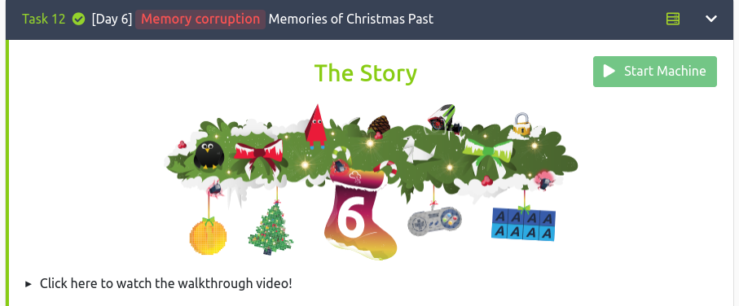

## Intro To Buffer Overflow Via Game And Simulation

I found this game in event Advent Cyber 2023 Try Hack Me

## What's You Learn In This Game
How Manipulation Game Using Buffer Overflow to Make coins so big and Manipulation Memory to Win and Get The FLAG

## Start Game
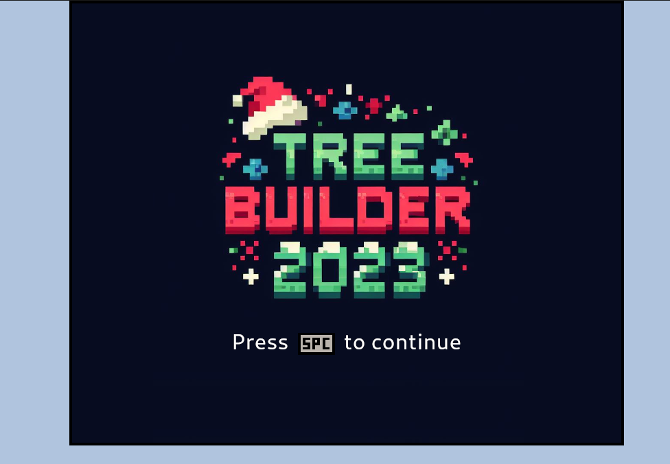

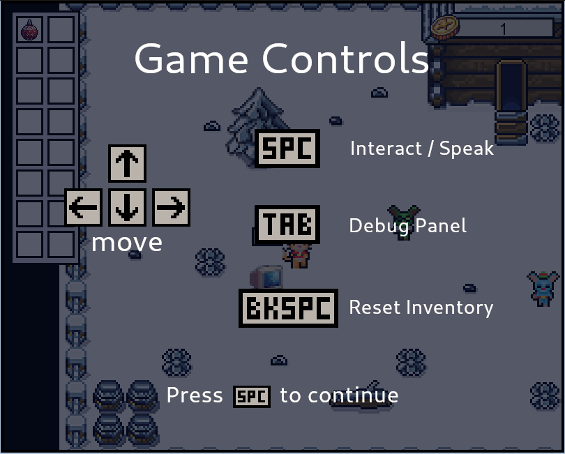

## Play and Undesrtanding How Game Work
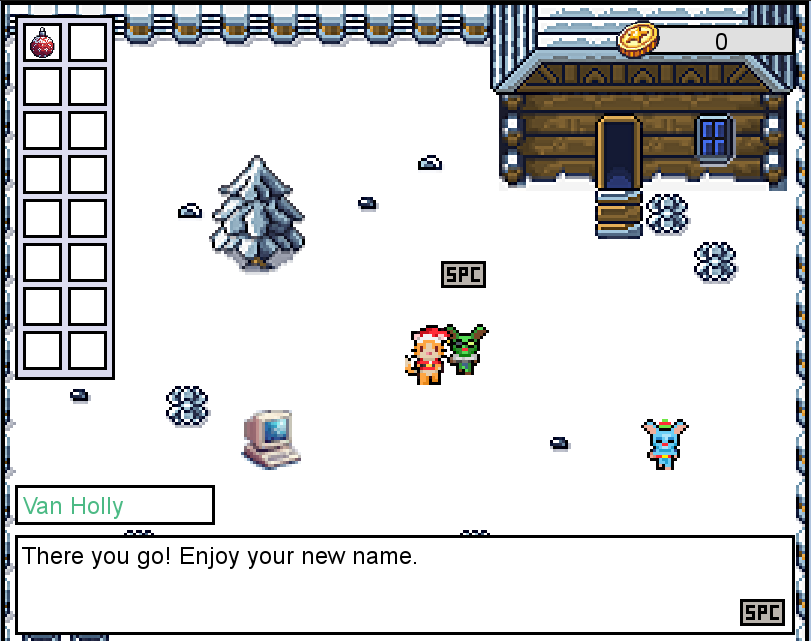

So if you walk to green character you can give a name, one abjad you purchase a 1 coins. 

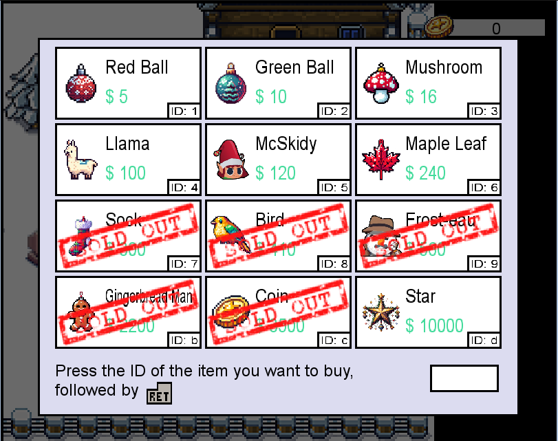

If you walk to blue character you can buy all item available using code.

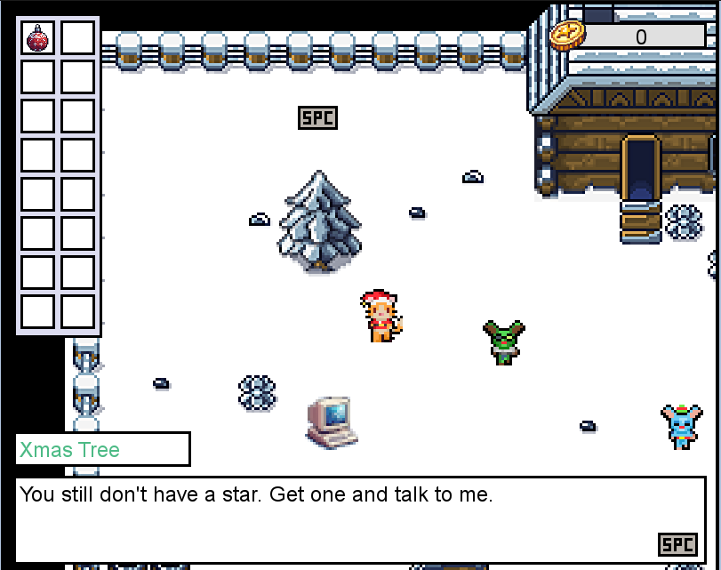

If you walk to tree, you can get the flag, but you should buy d(symbol) item

## IDEA
There is a two question

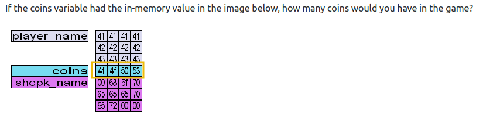

Question 1 no need Game Interaction (so very easy)
Question 2 Need Buffer Overflow

## SOLVE

### QUESTION 1
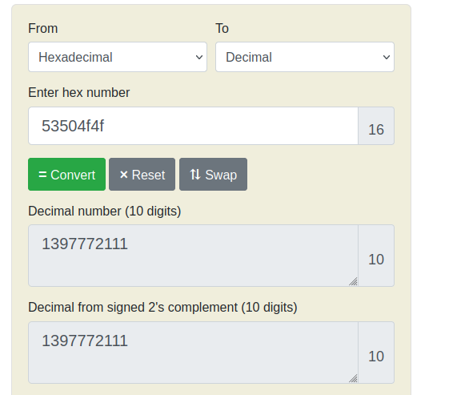

### QUESTION 2
In this case game, input name is Buffer Overflow Vuln

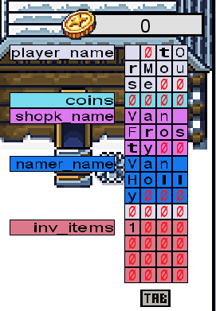

My idea is, overwrite the coins so that, my coins is big let's try. If you look this, you need 12 JUNK and 4 byte to overwrite the coins. First Let's SPC the comp tu get a point, every one SPC you get 1 coins. Need 16 SPC.

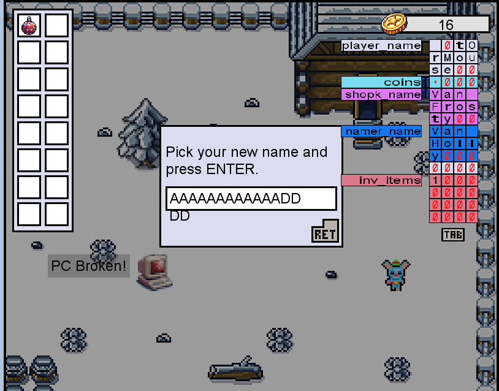

DDDD for ovewrite the coins, let's the result

Problem : i cannot buy d items cuz the blue character says, this unwin game, so imposibble to buy d item, so my idea is overwrite the inv_items using symbols shop need start (d).

BOOM !.

so now you can custom name buffer overflow for change inv_items to d (need to get flag).

After calculate, i need 44 JUNK and character d in the last (so total is 45)

let's BOF the name

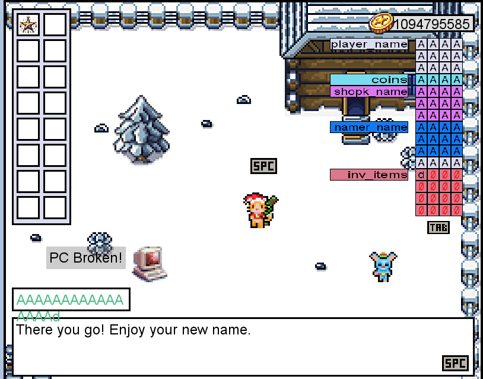

After BOF, let's go to tree

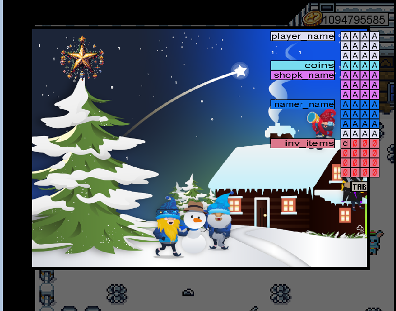

Boom

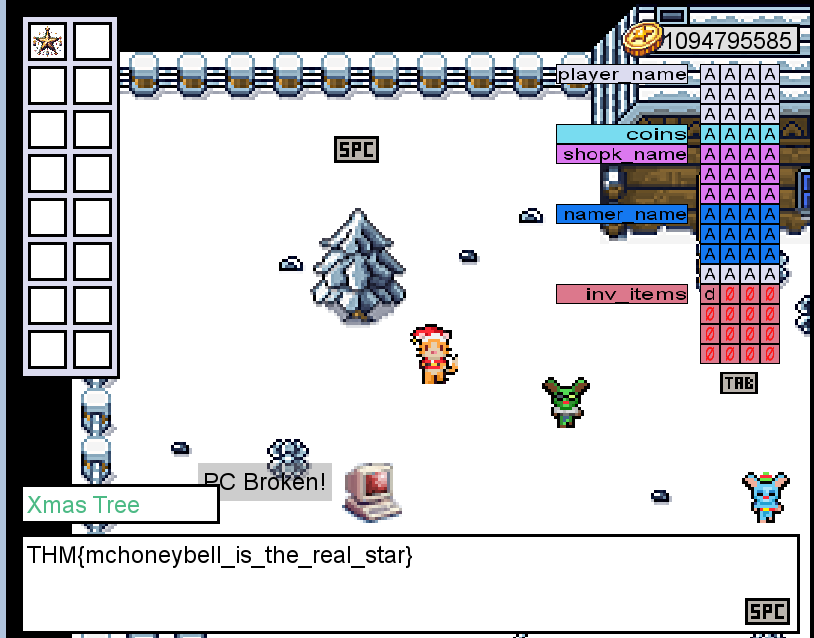